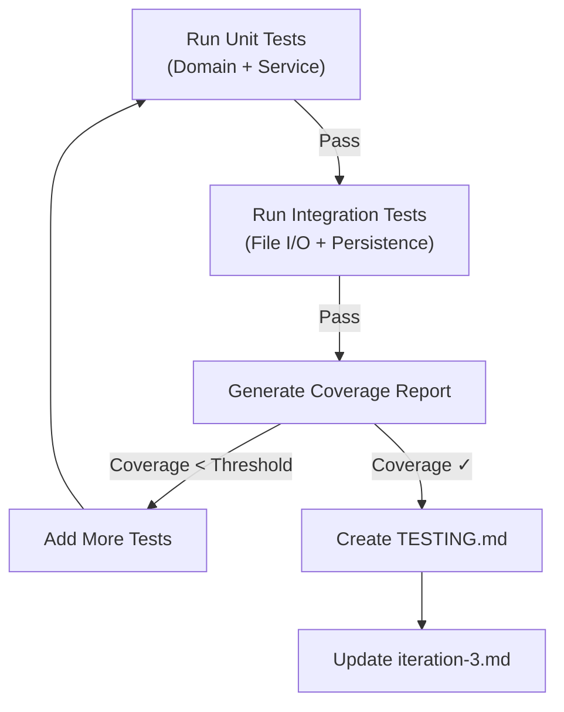

# Test Strategy for VetClinic - Lab 36 (Iteration 3)

## 1. Critical Scenarios (Must Test)

### Domain Invariants (High Priority)
- **Appointment Time Validation**: Future date requirement, appointment/vet conflicts
- **Medical Record Constraints**: Non-empty diagnosis/treatment, max length boundaries (500/1000 chars)
- **Pet & Owner Data**: Valid species, name constraints, circular dependencies
- **Status Transitions**: Scheduled → Completed → (blocked), Scheduled → Cancelled → (blocked)
- **Veterinarian Capacity**: No simultaneous appointments

### Business Rules (High Priority)
- **Rule 1**: Medical records can only be created for COMPLETED appointments
- **Rule 2**: Diagnosis must be non-empty and ≤500 characters
- **Rule 3**: Treatment must be non-empty and ≤1000 characters
- **Rule 4**: Appointment date cannot be in the past/present
- **Rule 5**: Vet cannot have overlapping appointments
- **Rule 6**: Medical records sorted by date (newest first)

### Analytics & Reporting (Medium Priority)
- **LINQ Query 1**: Veterinarian statistics (total, completed, cancelled, upcoming, avg/month, diagnoses)
- **LINQ Query 2**: Pet medical history with filtering
- **LINQ Query 3**: Appointment search (multi-criteria)
- **LINQ Query 4**: Clinic statistics (completion rate, cancellation rate, busiest vet)
- **LINQ Query 5**: Veterinarian workload distribution

### Strategy Pattern (Medium Priority)
- **KeywordBasedSeverityScorer**: High keywords vs. general terms
- **LengthBasedSeverityScorer**: Diagnosis length mapping
- **Runtime switching**: Strategy replacement without reloading

### Persistence & I/O (High Priority - Fault-Critical)
- **File-based persistence**: Save and load JSON data
- **Atomic writes**: No partial saves, atomicity on concurrent access
- **Data corruption handling**: Malformed JSON, missing files
- **Round-trip integrity**: Save → Load → Data equality

## 2. Hard-to-Test Code Zones & Solutions

### Zone 1: JsonDataStore (I/O & File System)
**Problem**: Direct file I/O, environment-dependent paths
**Solution**:
- Use `Path.GetTempPath()` for test isolation
- Mock `IDataStore<T>` interface where possible
- Create temporary files/directories per test
- Use `try-finally` to clean up test artifacts

### Zone 2: ClinicApp Console UI (User Input/Output)
**Problem**: Direct console.ReadLine(), console.WriteLine()
**Solution**:
- Test CLI through `AppointmentService` and `AnalyticsService` instead
- Assume UI correctly calls business logic
- Focus on service layer, not presentation

### Zone 3: DemoDataFactory (Test Data Generation)
**Problem**: Hard-coded demo data, potential for test pollution
**Solution**:
- Create focused builder classes (OwnerBuilder, PetBuilder, AppointmentBuilder)
- Use factory methods for common test scenarios
- Avoid shared state in test fixtures

### Zone 4: Circular Dependencies (Pet ↔ Owner)
**Problem**: Pet references Owner, Owner has Pets list
**Solution**:
- Create fresh instances per test
- Test circular refs in isolation (no shared lists)
- Verify readonly properties work correctly

## 3. Mock vs. Real Integration Strategy

### Use Real Implementation:
- ✅ `InMemoryAppointmentRepository` (already exists, in-memory, safe)
- ✅ Domain entity constructors (validation logic must be real)
- ✅ Status transitions (state machine validation is critical)
- ✅ LINQ queries (test against actual collections)

### Use Mocks:
- ❌ File I/O (use temp directories instead - better than mocks)
- ❌ `IAppointmentRepository` in isolation tests (but already have InMemory version)
- ✅ `IDiagnosisSeverityScorer` for testing service that depends on it

### Integration Tests (Real Flow):
- ✅ Save appointment → Complete → Create medical record → Load from file
- ✅ Multi-step: Create vet → Create pet → Book appointment → Complete → Add medical record
- ✅ Analytics queries on in-memory + file-loaded data

## 4. Negative/Fault Scenarios (Risk Zones)

### Data Validation Failures:
- Empty strings (diagnosis, treatment, reason, pet name, vet name, owner phone)
- Strings too long (>500 chars diagnosis, >1000 chars treatment)
- Null references (pet=null, vet=null, owner=null in appointment)
- Invalid IDs (id ≤ 0)
- Past/present appointment times

### State Machine Violations:
- Completing already-completed appointment
- Cancelling already-completed appointment
- Creating medical record for scheduled appointment
- Creating medical record for cancelled appointment

### File I/O Failures:
- Corrupted JSON (malformed syntax)
- Missing file (first load)
- Permission denied (read/write access)
- Concurrent access (race conditions)
- Disk full simulation (not easily testable, but document)

### Business Rule Violations:
- Duplicate medical records for same appointment
- Vet with overlapping appointments
- Medical history for pet with no records
- Analytics on empty clinic

### Arithmetic/Logic Errors:
- Division by zero in averages (when no appointments)
- Empty collections → null handling
- Date comparisons with timezone issues
- Ordering stability (same-date records)

## 5. Coverage Goals

- **Line Coverage**: ≥ 80% of domain + application layers
- **Branch Coverage**: ≥ 75% of if/else conditions
- **Critical Path**: 100% of business rules
- **Fault Paths**: ≥ 50% of exception handlers

## 6. Test Execution Strategy



## 7. Test Infrastructure Requirements

### XUnit Collections:
- Use `[Collection("Sequential")]` for file I/O tests to prevent parallel conflicts
- Unit tests can run in parallel

### Temporary Directories:
- Each file I/O test: `Path.Combine(Path.GetTempPath(), Guid.NewGuid())`
- Cleanup in `IDisposable` or try-finally

### Builders:
```csharp
class TestAppointmentBuilder
{
    var apt = new Appointment(1, pet, vet, DateTime.Now.AddHours(1), "Checkup");
    apt.Complete(); // If needed for medical record tests
    return apt;
}
```

## 8. CI/CD Requirements (for .github/workflows or equivalent)

```yaml
- Build project
- Run tests with coverage collection (coverlet)
- Parse coverage report (>80% gate)
- Fail if tests fail
- Generate HTML report
- Archive test results
```

---

**Test Strategy Author**: Lab 36 Planning
**Created**: 2026-05-21
**Status**: Ready for Implementation
