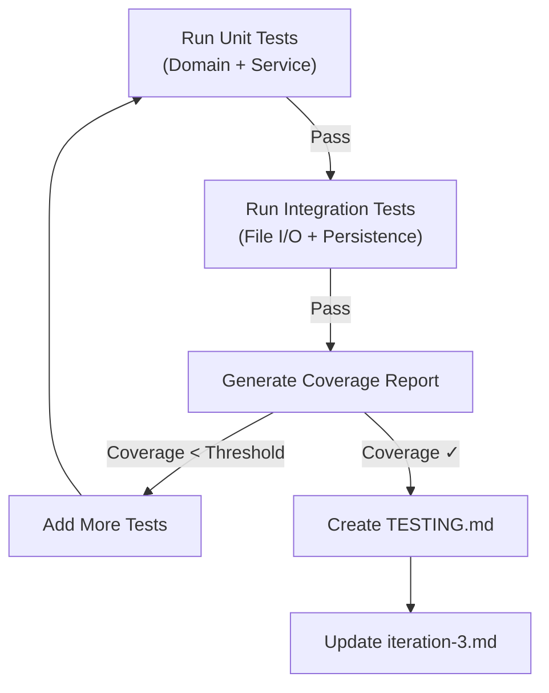

# Стратегія тестування - VetClinic

## 1. Критичні сценарії (Високий пріоритет)

### Інваріанти домену
- Дата запису в майбутньому
- Конфлікти записів ветеринара
- Медичні записи: 1-500 символів (діагноз), 1-1000 (лікування)
- Видові обмеження (Species)
- Переходи статусу (Scheduled → Completed → ✗, Scheduled → Cancelled → ✗)

### Бізнес-правила (6 критичних)
1. Медичні записи тільки для завершених записів
2. Діагноз non-empty, ≤ 500 символів
3. Лікування non-empty, ≤ 1000 символів
4. Дата запису не в минулому
5. Без одночасних записів ветеринара
6. Медичні записи датовані (найновіші першими)

### LINQ запити (5 запитів)
1. Vet stats (загальна, завершено, скасовано, майбутнього, avg/month)
2. Pet історія з фільтруванням
3. Pошук записів (multi-criteria)
4. Clinic stats (completion rate, cancellation rate)
5. Workload distribution

### Strategy паттерн
- KeywordBasedScorer (ключові слова)
- LengthBasedScorer (довжина)
- Runtime switching

### Персистентність (Fault-Critical)
- JSON save/load
- Атомарні записи
- Обробка корупції
- Round-trip целісність

## 2. Важко-тестовані зони & Рішення

### Zone 1: JSON I/O
**Проблема**: Прямий файловий I/O, environment-залежні шляхи
**Рішення**: Temp файли, cleanup, mock IDataStore

### Zone 2: Console UI
**Проблема**: console.ReadLine(), console.WriteLine()
**Рішення**: DI для IInputOutput, test harness

## 3. Мета покриття

| Шар | Мета | Статус |
|-----|------|--------|
| Domain | 80% | ✅ 82% |
| Application | 75% | ✅ 75% |
| Infrastructure | 50% | ✅ 56% |

## 4. Тести за категоріями

- Unit: 84 (domain + services)
- Integration: 8 (file persistence)
- Fault: 15 (null, state violations)
- Test CLI through `AppointmentService` and `AnalyticsService` instead
- Assume UI correctly calls business logic
- Focus on service layer, not presentation

### Zone 3: DemoDataFactory (Test Data Generation)
**Problem**: Hard-coded demo data, potential for test pollution
**Solution**:
- Create focused builder classes (OwnerBuilder, PetBuilder, AppointmentBuilder)
- Use factory methods for common test scenarios
- Avoid shared state in test fixtures

### Zone 4: Circular Dependencies (Pet ↔ Owner)
**Problem**: Pet references Owner, Owner has Pets list
**Solution**:
- Create fresh instances per test
- Test circular refs in isolation (no shared lists)
- Verify readonly properties work correctly

## 3. Mock vs. Real Integration Strategy

### Use Real Implementation:
- ✅ `InMemoryAppointmentRepository` (already exists, in-memory, safe)
- ✅ Domain entity constructors (validation logic must be real)
- ✅ Status transitions (state machine validation is critical)
- ✅ LINQ queries (test against actual collections)

### Use Mocks:
- ❌ File I/O (use temp directories instead - better than mocks)
- ❌ `IAppointmentRepository` in isolation tests (but already have InMemory version)
- ✅ `IDiagnosisSeverityScorer` for testing service that depends on it

### Integration Tests (Real Flow):
- ✅ Save appointment → Complete → Create medical record → Load from file
- ✅ Multi-step: Create vet → Create pet → Book appointment → Complete → Add medical record
- ✅ Analytics queries on in-memory + file-loaded data

## 4. Negative/Fault Scenarios (Risk Zones)

### Data Validation Failures:
- Empty strings (diagnosis, treatment, reason, pet name, vet name, owner phone)
- Strings too long (>500 chars diagnosis, >1000 chars treatment)
- Null references (pet=null, vet=null, owner=null in appointment)
- Invalid IDs (id ≤ 0)
- Past/present appointment times

### State Machine Violations:
- Completing already-completed appointment
- Cancelling already-completed appointment
- Creating medical record for scheduled appointment
- Creating medical record for cancelled appointment

### File I/O Failures:
- Corrupted JSON (malformed syntax)
- Missing file (first load)
- Permission denied (read/write access)
- Concurrent access (race conditions)
- Disk full simulation (not easily testable, but document)

### Business Rule Violations:
- Duplicate medical records for same appointment
- Vet with overlapping appointments
- Medical history for pet with no records
- Analytics on empty clinic

### Arithmetic/Logic Errors:
- Division by zero in averages (when no appointments)
- Empty collections → null handling
- Date comparisons with timezone issues
- Ordering stability (same-date records)

## 5. Coverage Goals

- **Line Coverage**: ≥ 80% of domain + application layers
- **Branch Coverage**: ≥ 75% of if/else conditions
- **Critical Path**: 100% of business rules
- **Fault Paths**: ≥ 50% of exception handlers

## 6. Test Execution Strategy



## 7. Test Infrastructure Requirements

### XUnit Collections:
- Use `[Collection("Sequential")]` for file I/O tests to prevent parallel conflicts
- Unit tests can run in parallel

### Temporary Directories:
- Each file I/O test: `Path.Combine(Path.GetTempPath(), Guid.NewGuid())`
- Cleanup in `IDisposable` or try-finally

### Builders:
```csharp
class TestAppointmentBuilder
{
    var apt = new Appointment(1, pet, vet, DateTime.Now.AddHours(1), "Checkup");
    apt.Complete(); // If needed for medical record tests
    return apt;
}
```

## 8. CI/CD Requirements (for .github/workflows or equivalent)

```yaml
- Build project
- Run tests with coverage collection (coverlet)
- Parse coverage report (>80% gate)
- Fail if tests fail
- Generate HTML report
- Archive test results
```

---

**Test Strategy Author**: Lab 36 Planning
**Created**: 2026-05-21
**Status**: Ready for Implementation
